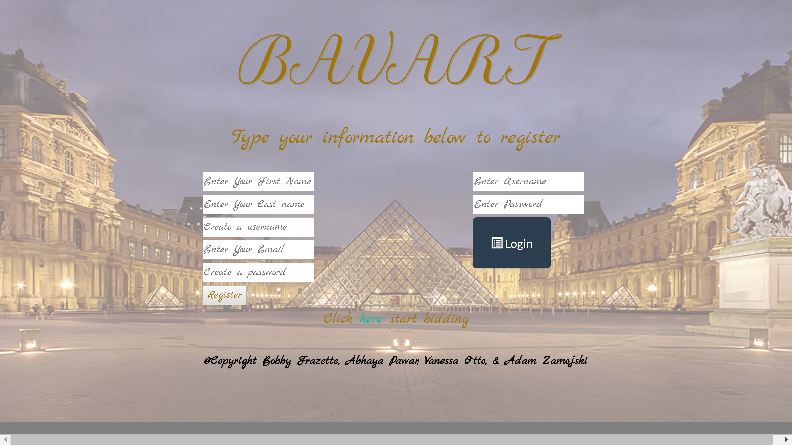
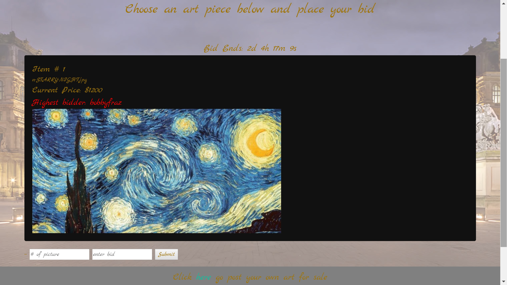
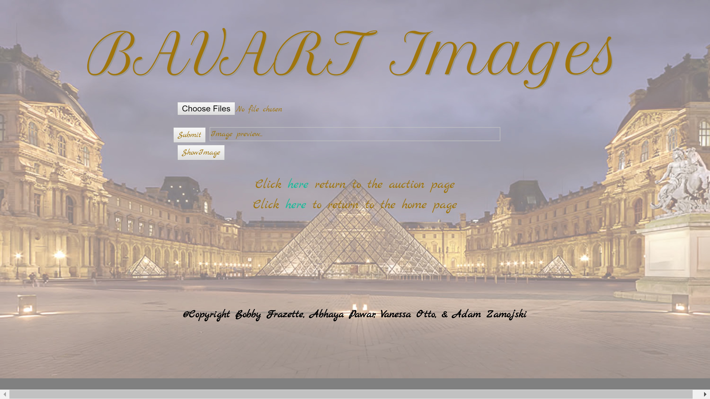

# BAVART

## What is BAVART?
An art auction website that allows users to post their artwork for sale.

## How does BAVART work?
After the user signs in, they can scroll through the available art up for auction and bid on the item of their choosing.  When the time runs out on the item whoever the higher bidder is will be the new owner of the art piece.
Users can also add artwork of their own to be placed in the auction page of BAVART

## What technologies did we implement?
Technology in the program itself:
HTML, CSS, Bootstrap, Google Fonts, JavaScript, JQuery, Sequelize, Handlebars, BLOBs, MySQL, Node.JS, Express.JS, Mutler
Technology used to help create the program:
Heroku, GitHub, Sublime, Trello, Google Slides

## What “New” technologies are used?
BLOBs
Mutler
CryptoJS
MD5 Hatching

## What problems did we experience?
Logging in to a MySQL database backed application
Storing images in a MySQL database
Posting images to a MySQL database
Linking different files in the folders
Determining which user posted a bid
Crypto errors
Various bugs
Basically everything...

## Future plans for BAVART
10% discount
Displaying video of Bob Ross on home page
Watermark the images being auctioned
Have the artwork be interactive
User trends
Categorize the art
Other cool things